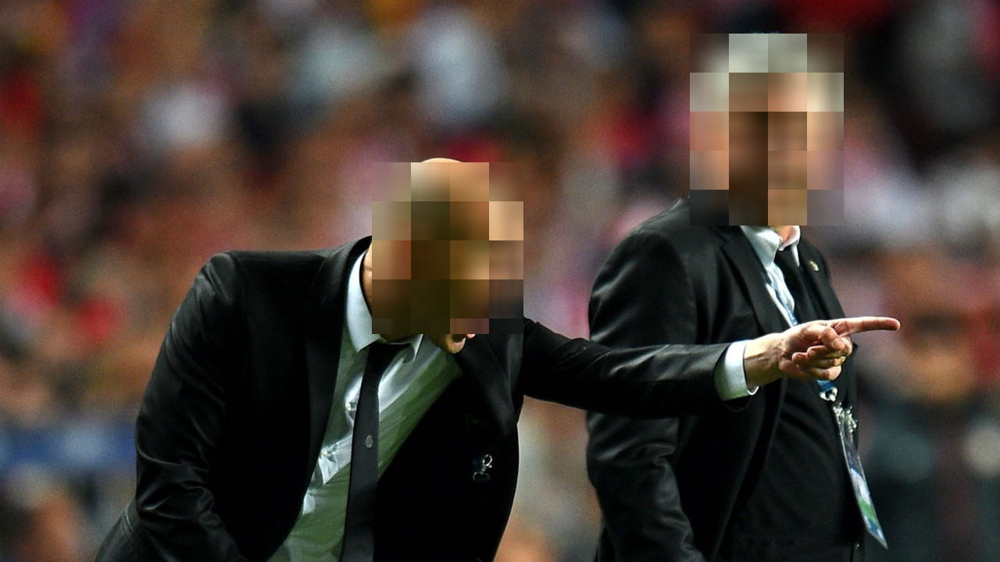

# yolov5_face_msc
这是一个给人脸打马赛克的项目

项目由yolov5修改，先使用yolov5对人脸进行训练检测，再修改代码使其打马赛克

本项目中有数据集以及训练完的权重文件

使用是只需把detect.py文件中的路径更改就可以使用了

对与本地没有运行环境以及对yolo代码不熟悉的人来说使用是比较困难的，为此我在ubuntu中使用pyinstaller对项目进行了打包

https://drive.google.com/file/d/1zs3OxwwmhHquxfT-zlkgHU6zs3PvJpA3/view
本连接下载压缩包，本.exe文件只能在linux中使用

以下为使用后的效果图
